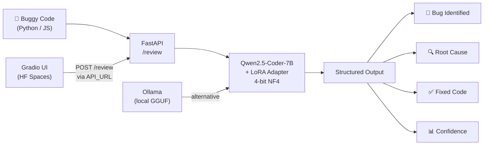
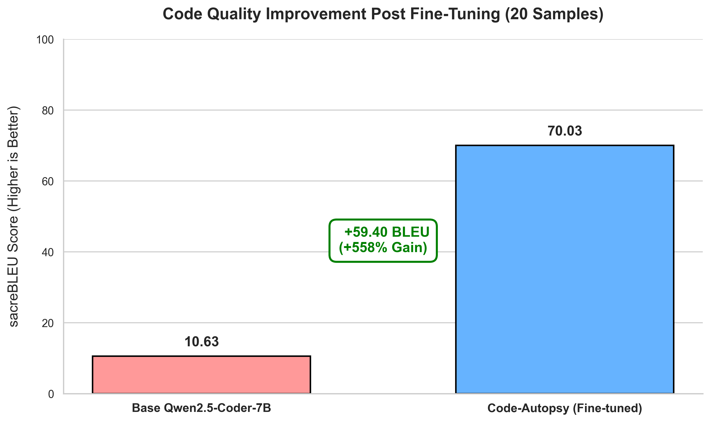

<div align="center">


# 🔬 Code Autopsy

**A QLoRA fine-tuned code review model** based on Qwen2.5-Coder-7B-Instruct.  
Paste buggy code → get a structured analysis: **bug ID, root cause, and auto-fix**.

[**🤗 Model**](https://huggingface.co/Ares19v/code-autopsy-7b) &nbsp;·&nbsp;
[**🧩 LoRA Adapter**](https://huggingface.co/Ares19v/code-autopsy-lora) &nbsp;·&nbsp;
[**🚀 Live Demo**](https://huggingface.co/spaces/Ares19v/code-autopsy) &nbsp;·&nbsp;
[**📊 W&B Run**](https://wandb.ai/Ares19v/code-autopsy)

</div>

---

## Architecture



---

## Results

### Quantitative: sacreBLEU (n=20)

| Model | BLEU Score | Δ vs Base |
|---|---|---|
| Base (Qwen2.5-Coder-7B) | 10.63 | — |
| **Code Autopsy (fine-tuned)** | **70.03** | **+59.40 (+558%)** |

> Fine-tuned in **1 epoch** on an RTX 5060 (8 GB VRAM) using 4-bit NF4 QLoRA.



### Training Convergence

| Metric | Value |
|---|---|
| Final train loss | 0.407 |
| Final eval loss | 0.297 |
| Eval token accuracy | 92.3% |
| Trainable params | 5.05M / 4.36B (0.12%) |

---

## Before / After Examples

### Python — ZeroDivisionError

| | Code |
|---|---|
| **Buggy** | `def avg(nums): return sum(nums) / len(nums)` |
| **Fixed** | `def avg(nums): return sum(nums) / len(nums) if nums else 0.0` |

**Bug Identified:** `ZeroDivisionError` when `nums` is an empty list.  
**Root Cause:** No guard clause for the empty input case. `len([])` returns 0, causing division by zero.

---

### Python — Mutable Default Argument

| | Code |
|---|---|
| **Buggy** | `def append(val, lst=[]): lst.append(val); return lst` |
| **Fixed** | `def append(val, lst=None): if lst is None: lst = []; lst.append(val); return lst` |

**Bug Identified:** Mutable default argument `lst=[]` is shared across all calls.  
**Root Cause:** Python evaluates default arguments once at function definition time, not per-call.

---

### JavaScript — Missing `await`

| | Code |
|---|---|
| **Buggy** | `const data = response.json(); return data.name;` |
| **Fixed** | `const data = await response.json(); return data.name;` |

**Bug Identified:** `response.json()` returns a `Promise`, not the parsed data.  
**Root Cause:** `Response.json()` is asynchronous — without `await`, `data` holds the Promise object.

---

### JavaScript — `var` Closure in Loop

| | Code |
|---|---|
| **Buggy** | `for (var i = 0; i < 3; i++) { setTimeout(() => console.log(i), 100); }` |
| **Fixed** | `for (let i = 0; i < 3; i++) { setTimeout(() => console.log(i), 100); }` |

**Bug Identified:** Prints `3, 3, 3` instead of `0, 1, 2`.  
**Root Cause:** `var` is function-scoped; all closures share the same `i`. Replace with `let` (block-scoped).

---

## Quick Start (Windows)

```
1. Double-click INSTALL.bat    ← sets up venv + installs everything
2. Fill in your keys in .env
3. Double-click Run_Project.bat ← starts API + UI, opens browser
```

---

## Local Setup (Manual)

### 1. Clone & install

```bash
git clone https://github.com/Ares19v/Code-Autopsy.git
cd Code-Autopsy

python -m venv .venv
source .venv/bin/activate          # Windows: .venv\Scripts\activate

# Install PyTorch first (match your CUDA version)
pip install torch --index-url https://download.pytorch.org/whl/cu124

pip install -r requirements.txt
```

### 2. Configure environment

```bash
cp .env.example .env
# Fill in: HF_TOKEN, WANDB_API_KEY, GEMINI_API_KEY
```

### 3. Prepare dataset

```bash
# Dry-run first (no downloads, validates formatting logic)
python data/prepare_dataset.py --dry-run

# Full run (~20k examples, downloads ~5GB)
python data/prepare_dataset.py --max-samples 20000
```

### 4. Train

```bash
# Debug: 1 step, no W&B (validates VRAM fits)
python training/train.py --debug

# Full training run (1 epoch, logs to W&B)
python training/train.py
```

### 5. Evaluate

```bash
# sacreBLEU: base vs fine-tuned
python eval/eval_codebleu.py --adapter ./adapter --max-samples 20

# LLM-as-judge (100 examples, calls Gemini API)
python eval/eval_llm_judge.py --adapter ./adapter
```

### 6. Serve (FastAPI)

```bash
uvicorn serve.api:app --host 0.0.0.0 --port 8000

# Test it:
curl -X POST http://localhost:8000/review \
  -H "Content-Type: application/json" \
  -d '{"code": "def avg(x): return sum(x)/len(x)", "language": "python"}'
```

### 7. Launch Gradio demo

```bash
python demo/app.py
# Opens at http://localhost:7860
```

---

## Docker

```bash
# Build and run everything (API + Demo)
docker compose up --build

# API only
docker build -f serve/Dockerfile -t code-autopsy-serve .
docker run -p 8000:8000 \
  -v $(pwd)/adapter:/app/adapter:ro \
  --env-file .env \
  --gpus all \
  code-autopsy-serve
```

---

## Ollama (local GGUF)

```bash
# 1. Merge adapter + convert to GGUF
python publish.py --skip-merge=false   # creates ./merged_model/
bash convert_to_gguf.sh               # requires llama.cpp

# 2. Create & run
ollama create code-autopsy -f Modelfile
ollama run code-autopsy
```

---

## Publish to HuggingFace

```bash
# Push both merged model + raw adapter
python publish.py

# Adapter only (faster, no merge step)
python publish.py --skip-merge
```

---

## Project Structure

```
code-autopsy/
├── data/
│   ├── raw/                    # gitignored
│   ├── processed/              # gitignored
│   └── prepare_dataset.py
├── training/
│   ├── train.py                # SFTTrainer + QLoRA main script
│   ├── config.yaml             # All hyperparameters
│   └── utils.py                # Shared helpers
├── eval/
│   ├── eval_codebleu.py        # Quantitative BLEU eval
│   ├── eval_llm_judge.py       # Gemini LLM-as-judge
│   ├── plot_results.py         # Results chart generator
│   └── results/                # Saved evaluation outputs
├── serve/
│   ├── api.py                  # FastAPI /review endpoint
│   └── Dockerfile
├── demo/
│   ├── app.py                  # Gradio UI
│   └── Dockerfile
├── tests/
│   └── test_utils.py           # CI unit tests (no GPU required)
├── .github/
│   └── workflows/ci.yml        # GitHub Actions CI
├── publish.py                  # Merge + push to HF Hub
├── Modelfile                   # Ollama config
├── convert_to_gguf.sh          # GGUF conversion
├── docker-compose.yml          # Full stack orchestration
├── requirements.txt
├── .env.example
├── INSTALL.bat                 # Windows one-click setup
├── Run_Project.bat             # Windows one-click launcher
└── README.md
```

---

## Hardware

Trained on an **HP Omen with RTX 5060** using 4-bit NF4 quantization via BitsAndBytes.

| Setting | Value |
|---|---|
| GPU | NVIDIA RTX 5060 (8 GB VRAM) |
| Quantization | NF4 4-bit (BitsAndBytes) |
| Precision | bfloat16 compute |
| Effective batch | 16 (4 × 4 grad accum) |
| Max seq length | 512 tokens |
| Optimizer | adamw_8bit |
| Epochs | 1 |

---

<div align="center">
Made with ❤️ by <a href="https://huggingface.co/Ares19v">Ares19v</a>
</div>
